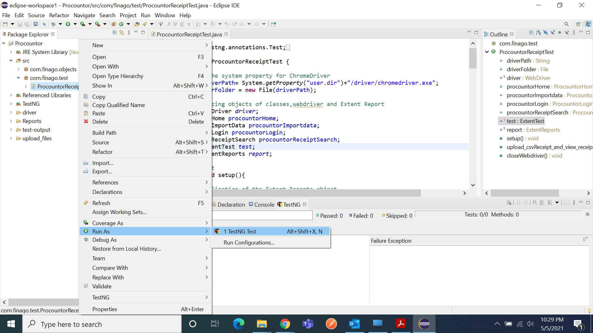
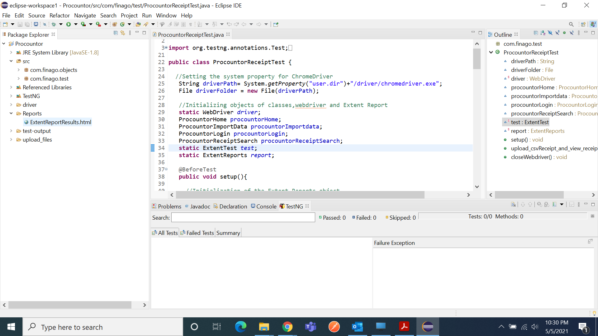

<h1 align="center">Page-Object-Model</h1>

  
This application is built to import invoices in CSV format through a user interface by utilising the Import data function.
The automated UI test Logs In and import a CSV file to any upload software.

  

# Demo

## Languages, libraries and tools used

* __[Java 8](https://www.oracle.com/in/java/technologies/javase/javase-jdk8-downloads.html)__
* __[Selenium](https://www.selenium.dev/downloads/)__
* __[TestNG](https://testng.org/doc/eclipse.html)__
* __[Extent reports](https://www.extentreports.com/)__
* __[Eclipse](https://www.eclipse.org/)__

Above Features are used to make code simple, generic, understandable, clean and easily maintainable
for future development.

## Automated tests

1. To run a test, open the Project window, and then open com.finago.test package name and then right-click 
on ProcountorReceiptTest.java and goto RunAs then Click on TestNG Test.

2. To see the reports, open the Project window, and then right-click then click on refresh then open the Reports 
Folder and then double click on ExtentReportResults.html file or open the ExtentReportResults.html file on the default browser.

# Prerequisites
* __Eclipse__
* __Java__

# Built With

* __[Eclipse Oxygen](https://www.eclipse.org/downloads/packages/release/oxygen)__ - The IDE for Selenium Automation Test
* __[Java 8](https://www.oracle.com/in/java/technologies/javase/javase-jdk8-downloads.html)__ - Language used to build the application
